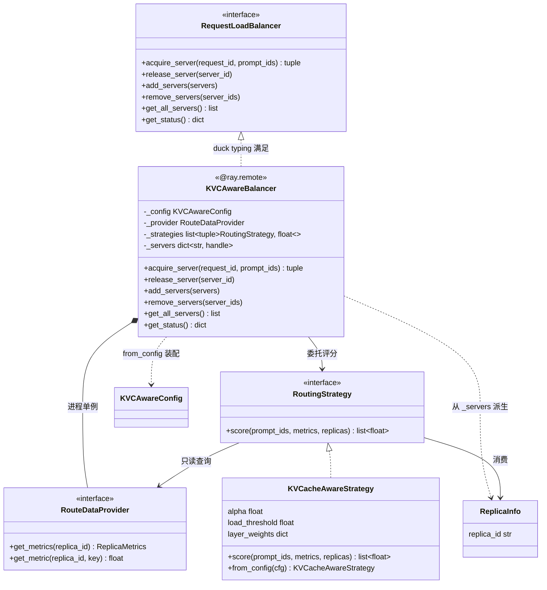
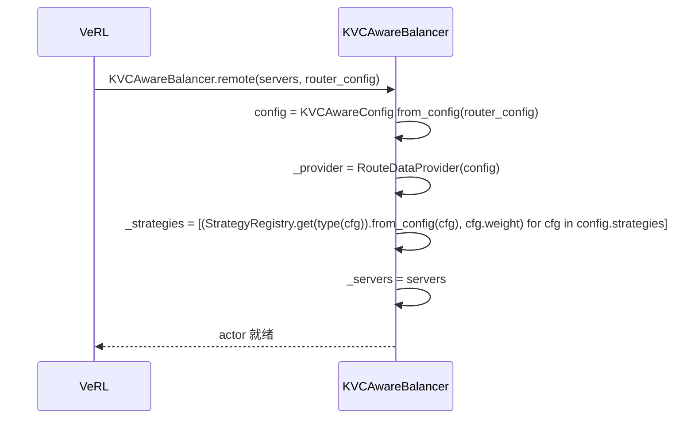
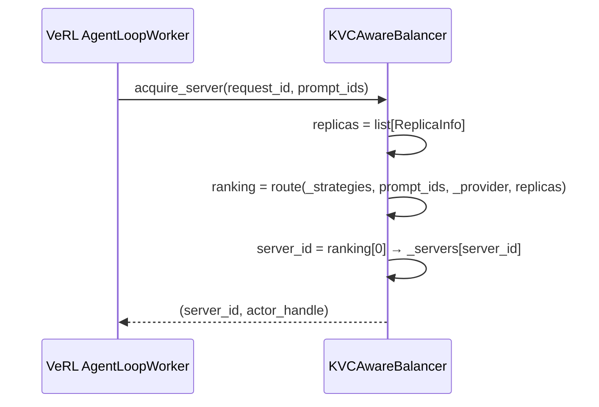
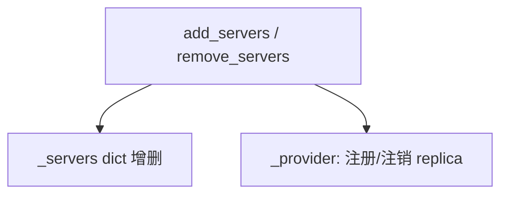

# 顶层编排模块详细设计

> **本文范围**：聚焦 Balancer 作为「纯框架外壳」的定位、周边模块接口、核心类图、流程与生命周期，以及用例规格（正常/异常输入、功能测试、端到端测试）。**不展开**路由决策算法的内部细节——那是 Strategy 模块详细设计的范畴。

---

## 1 定位与职责

Balancer 是 `llm_router` 的**顶层入口模块**，也是唯一的 `@ray.remote` actor。它装配 Config / Strategy、collectors（统一封装为 `RouteDataProvider` facade，内部 = collector 采集 + store 存储）三个子模块，组成一个可被 VeRL 当作 router 使用的整体。

**定位：纯框架外壳**——不含路由决策算法，不含 KVC 业务逻辑。路由决策归属 Strategy 模块，Balancer 只做三件事：**组件构造与装配、组件生命周期管理、把路由请求委托给 Strategy 模块**。

| 属于 Balancer | 不属于 Balancer（Strategy 模块） |
|---|---|
| 从 `router_config` 解析装配 | 路由决策算法 |
| 拥有 RouteDataProvider、server pool | 策略实现 |
| `acquire_server` 委托 + 映射回 `(server_id, handle)` | 加权组合逻辑 |
| server pool 增删 + 两处状态同步 | 类型定义 |
| 满足 VeRL 6 个接口 | |

**设计约束**：

- 不维护 inflight：load 信号来自 RouteDataProvider，`release_server` v1 为 no-op
- 不直接读指标 / 不算 load：一律经 RouteDataProvider 由策略查询
- 不暴露 actor handle 给策略层：handle 只在 Balancer 内部 `_servers` dict

---

## 2 周边模块接口梳理

### 2.1 VeRL（上游调用方）

VeRL 已实现 `plugin_extension` 路径（`verl/workers/rollout/router.py`），Balancer 作为自定义 router 被注入：

```
router_config_path → _resolve_config_path（支持 pkg://）→ hydra.compose 展开 defaults
                ↓
        OmegaConf.to_container(resolve=True) → plain dict
                ↓
        提取 router_class FQN → importlib.import_module → 获取 class
                ↓
        ray.remote(cls).remote(servers, yaml_config_dict)
```

**关键细节**：

1. 构造函数第二个参数是 **plain dict**：VeRL 用 `hydra.compose` 展开 `defaults`（**非** `OmegaConf.load`——后者不展开分层 YAML）得到 `cfg`，再 `OmegaConf.to_container(cfg, resolve=True)` 完全解析为普通 dict/list。
2. YAML 顶层 `router_class` 标识 Balancer FQN，VeRL 用 `importlib` 定位类（不走 `hydra.utils.instantiate`）。`from_config` 忽略此字段，只解析 `strategies`/`collector`/`cache_store`。
3. `router_config_path` 支持 `pkg://<package>/<rel/path>` 包内路径（由 `_resolve_config_path` 用 `importlib.util.find_spec` 解析）或文件系统路径。

> **设计说明**：`_target_` 在本体系中只用于子层（strategies）的多态 instantiate，顶层 Balancer FQN 用独立的 `router_class` 字段标识，避免 `_target_` 语义混用。

VeRL `RequestLoadBalancer` 要求 Balancer 实现 6 个接口：

| 接口 | 签名 | 功能 |
|---|---|---|
| `acquire_server` | `(request_id, prompt_ids) -> (server_id, handle)` | 委托 `route()` → 取最优 replica 映射回 handle |
| `release_server` | `(server_id) -> None` | **no-op**（不维护 inflight） |
| `add_servers` | `(servers: dict) -> None` | 两处同步：`_servers`、`_provider` replica 注册 |
| `remove_servers` | `(server_ids: list) -> None` | 两处同步（反向移除） |
| `get_all_servers` | `() -> list[str]` | 返回 `list(self._servers.keys())` |
| `get_status` | `() -> dict` | 返回构造与路由状态：`servers` / `provider` / `strategies` / `route_calls`（用于跨远端边界校验构造流程） |

> `@ray.remote` 使 Balancer 成为全局单 actor，多个 AgentLoopWorker 共享同一实例。

### 2.2 Config 模块（✅ 方案已确定）

| Config 提供 | Balancer 如何使用 |
|---|---|
| `KVCAwareConfig`（含 `strategies` / `collector` / `cache_store`） | 构造时 `KVCAwareConfig.from_config(router_config)` 解析 |
| `KVCAwareStrategyConfig`（含 `alpha` / `load_threshold` / `layer_weights` / `weight` / `collector_names`） | 实例化为 `(KVCacheAwareStrategy, weight)` |
| `CollectorConfig`（`http_polling`/`long_connection` 连接类型参数）+ `CacheStoreConfig`（`kv_cache_store_type`/`ttl`） | 传给 `RouteDataProvider` facade：前者配 collector，后者配 store |

- 策略通过 `collector_names`（`list[str]`）声明依赖的 collector 名称；具体激活哪些 collector 由 `RouteDataProvider` 按策略声明决定（见 §2.4），Balancer 不直接接触 collector。
- `router_config` 是 plain dict（由 VeRL `OmegaConf.to_container` 生成），`from_config` 需兼容 plain dict，并忽略 `router_class` 等非业务字段（VeRL 侧元数据）。
- Config 模块详细设计见 `detailed_config.md`。

### 2.3 Strategy 模块（✅ 方案已确定）

| 接口 | 作用 | Balancer 调用时机 |
|---|---|---|
| `StrategyRegistry.get(cfg_cls) → class` | 按策略 config dataclass 类型查 runtime 策略类 | 构造时 |
| `route([(strategy, weight), ...], prompt_ids, provider, replicas) → list[str]` | 加权评分+排名，返回 **replica_id 列表**（最优在前） | 每请求 |

构造流程：遍历 `config.strategies`，按每个 config 的 dataclass 类型经 `StrategyRegistry.get(type(cfg))` 定位 runtime 类，调 `.from_config(cfg)` 实例化策略，组装 `(strategy, cfg.weight)` 列表（v1 单策略即 `KVCacheAwareStrategy`）。
请求流程：`route(_strategies, prompt_ids, _provider, replicas)` → 取 `ranking[0]`（即最优 replica_id）→ `_servers[id]` 映射回 handle。`score()` 是策略内部实现细节，Balancer 不直接调用。

> `request_id` 只停留在 Balancer 边界（Protocol 参数），不下沉到 `route()`——v1 打分只用 `prompt_ids`。若未来策略需要 request 级上下文（session id / 优先级等），再引入 context 对象。
> `ReplicaInfo` 只携带 `replica_id`，actor handle 不下沉到策略层。

### 2.4 collectors 模块（`RouteDataProvider` facade = collector + store）

第一版 collector（采集）与 store（存储 / 查询）组合在 collectors 模块下，统一封装为 `RouteDataProvider` facade，是策略层获取所有指标的统一入口。

| 接口 | 签名 | 功能 |
|---|---|---|
| `get_metric` | `(replica_id, key) -> float | int` | 按 canonical key 查询轮询指标 |
| `get_metrics` | `(replica_id) -> ReplicaMetrics` | 获取 replica 全部轮询指标快照 |

> 上表为**轮询指标**查询接口（load 类指标：gpu_util / queue_depth 等）。**per-request KV cache 前缀命中**查询（KVCAwareStrategy 算 `S_cache` 所需，依赖 `prompt_ids`）亦归属 RouteDataProvider，确切接口待其详细设计确定（见 §6 第 1 项）。

构造方式：`RouteDataProvider(config)`——facade 内部用 `config.collector`（连接类型参数）配 collector、`config.cache_store` 配 store；需激活的 collector 集合由各策略的 `collector_names` 汇总而来（注入方式属 provider 详细设计）

Balancer 对 `RouteDataProvider` 的使用：
- 构造时创建，注入给 `route()`
- `add_servers` / `remove_servers` 时同步更新 replica 注册

> Collector 的具体采集与解码逻辑封装在 `RouteDataProvider` 内部（属其模块设计）；激活哪些 collector 由各策略声明的 `collector_names` 决定。Balancer 只持有 provider 引用，不直接创建/启停 collector。

---

## 3 类图



---

## 4 流程与生命周期

### 4.1 构造



### 4.2 acquire_server



### 4.3 服务实例增删

`add_servers` / `remove_servers` 必须同时维护两处状态：



---

## 5 用例规格

### 5.1 入参和返回值的正常/异常用例

#### `__init__`

| 用例 | 输入 | 期望输出 |
|---|---|---|
| 正常 | `servers={"s0": handle}`, `router_config` 含完整业务字段 | 全部子组件初始化 |
| 空 servers | `servers={}` | raise ValueError |
| config 缺字段 | `router_config` 缺 `strategies`（必填） | raise ConfigError |
| config 可选字段缺失 | `router_config` 缺 `collector` / `cache_store` | 正常构造，用默认值 |
| 顶层 VeRL 元数据 | `router_config` 含顶层 `router_class` | 正常构造，`router_class` 被 `from_config` 忽略 |

#### `acquire_server`

| 用例 | 输入 | 期望输出 |
|---|---|---|
| 正常 | `request_id="r1"`, `prompt_ids=[1,2,3]` | `(server_id, handle)` |
| 无可用 replica | `_servers` 为空，或全部 replica 被黑名单（load ≥ threshold） | raise RuntimeError |
| prompt_ids=None | `prompt_ids=None` | 正常返回（策略退化为 load 排序） |

#### `add_servers`

| 用例 | 输入 | 期望输出 |
|---|---|---|
| 正常 | `{"s1": h1, "s2": h2}` | pool 新增 s1/s2 |
| 空 dict | `{}` | 正常返回，pool 不变 |
| 重复 id | `{"s0": new_handle}`（s0 已在 pool） | 覆盖原 handle（幂等，对齐 VeRL bulk-add 语义，不报错） |

#### `remove_servers`

| 用例 | 输入 | 期望输出 |
|---|---|---|
| 正常 | `["s0"]`（s0 在 pool） | pool 移除 s0 |
| 空 list | `[]` | 正常返回，pool 不变 |
| 不存在的 id | `["s999"]` | 正常返回，pool 不变 |

#### `release_server` / `get_all_servers` / `get_status`

| 接口 | 正常输入 | 期望输出 | 异常输入 | 期望输出 |
|---|---|---|---|---|
| `release_server` | `"s0"` | `None`（no-op） | `"s999"`（不存在） | `None`（no-op） |
| `get_all_servers` | 无 | `list[str]` | pool 为空时 | `[]` |
| `get_status` | 无 | `{servers, provider, strategies, route_calls}` | 任意 | 同左（无异常分支） |

### 5.2 功能测试

#### acquire_server 路由逻辑

| 用例 | 测试点 | 构造方式 | 期望输出 |
|---|---|---|---|
| 最优 replica 被选中 | 取 `ranking[0]` 映射 handle | 3 个 server，mock `route()` 返回 `["s0","s1","s2"]` | 返回 `(s0, h0)` |
| prompt_ids 透传 route | 不同 prompt → 不同返回（route 按 prompt_ids 区分） | 相同 pool，两次 acquire 不同 prompt_ids；mock `route()` 第一次返回 `["s2",...]`，第二次 `["s0",...]` | 第一次 `(s2, h2)`，第二次 `(s0, h0)` |
| replica_id 映射 handle | 返回的 id 对应的 handle | 构造 `_servers={"s0":h0,"s1":h1}`，mock `route()` 返回 `["s1","s0"]` | 返回 `(s1, h1)` |
| 无可用 replica | route 返回空 / 全黑名单 → RuntimeError | mock `route()` 返回 `[]` | acquire raises `RuntimeError` |

#### add_servers 两处同步

| 用例 | 测试点 | 构造方式 | 期望输出 |
|---|---|---|---|
| `_servers` 更新 | add 后 pool 包含新 id | `add_servers({"s1":h1})` | `_servers` 包含 s1 |
| `_provider` 注册新 replica | add 后 provider 已登记 s1 | 同上 | s1 在 provider 已注册（断言注册状态，而非要求指标立即非空——依采集周期） |
| `get_all_servers` 反映新增 | add 后列表含新 id | 同上 | `get_all_servers()` 含 s1 |

#### remove_servers 两处同步

| 用例 | 测试点 | 构造方式 | 期望输出 |
|---|---|---|---|
| `_servers` 移除 | remove 后 pool 不含该 id | `remove_servers(["s0"])` | `_servers` 不含 s0 |
| `_provider` 清理 | remove 后 provider 清除该 replica 指标 | 同上 | `_provider.get_metrics("s0")` 返回默认空值 |
| `get_all_servers` 反映移除 | remove 后列表不含该 id | 同上 | `get_all_servers()` 不含 s0 |

### 5.3 端到端测试

#### A. mock VeRL（不依赖 VeRL 仓库）

直接构造 KVCAwareBalancer 实例（不走 `get_router_handle`），mock RouteDataProvider / Strategy。

| 用例 | 测试点 | 构造方式 | 期望输出 |
|---|---|---|---|
| 构造 + 全组件装配 | config → RouteDataProvider → Strategy 全链路 | 写临时 YAML，`hydra.compose` 展开 `defaults` → `to_container` → `KVCAwareConfig.from_config` → 手动 `KVCAwareBalancer.__init__(servers, config_dict)`，mock 底层 | `_servers` / `_provider` / `_strategies` 均初始化 |
| 策略实例化 | `StrategyRegistry` 分发 + weight 取自 cfg | config 含 1 条 `KVCAwareStrategyConfig(weight=0.7)`，构造后检查 `_strategies` | `_strategies == [(KVCacheAwareStrategy 实例, 0.7)]`，即 `isinstance(_strategies[0][0], KVCacheAwareStrategy)` 且 weight 正确 |
| acquire → release → acquire | release 不影响后续路由 | 构造 Balancer（mock `route()` 返回 `["s0",...]`），`acquire_server("r1",[1,2])` → `release_server("s0")` → `acquire_server("r2",[1,2])` | 两次 acquire 均返回有效 server；release 返回 None；pool 不变 |
| 动态增删后路由 | add → acquire → remove → acquire | 构造 Balancer，`add_servers({"s3":h3})`，`acquire_server("r2",[1])`，`remove_servers(["s0"])`，`acquire_server("r3",[1])` | 每次 acquire 返回有效 server；remove 后不返回 s0 |

#### B. 接入 VeRL（使用 VeRL `get_router_handle`）

使用 VeRL 的 `_create_plugin_extension` 路径创建 Balancer，mock 底层模块。

| 用例 | 测试点 | 构造方式 | 期望输出 |
|---|---|---|---|
| plugin_extension 创建 | YAML → `importlib` → `ray.remote` → 实例化 | 写临时 YAML（含 `router_class` + 业务字段），`RouterConfig(router_strategy="plugin_extension", router_config_path=path)`，调用 `get_router_handle(servers, config)` | `ray.get(actor.get_all_servers.remote())` 返回 server 列表 |
| acquire → release 周期 | VeRL AgentLoopWorker 视角 | 同上创建 actor，`ray.get(actor.acquire_server.remote("r1",[1,2]))` → `ray.get(actor.release_server.remote("s0"))` | acquire 返回 `(server_id, handle)`；release 返回 None |
| 多 Worker 共享 | actor 单例 + 并发无竞态 | 同上创建 actor，两个线程并发 `ray.get(actor.acquire_server.remote(...))` | 两次均返回有效结果（v1 不维护 inflight，不验 pool 一致性，只验单例共享不崩） |

---

## 6 待讨论 / 遗留

1. **provider 对 Balancer 的接口待 collectors 模块确定**：
   - **lifecycle**：actor 构造时 `start()`、销毁时 `stop()`（当前 doc 未提，需补）；
   - **register / unregister 签名**：`add_servers` / `remove_servers` 两处同步里调 provider 的方法签名待定。

   > collector 激活、store 存储结构与 ttl、per-request KV cache 查询接口、`collector_names` 汇总等 facade 内部实现，均属 collectors 模块详细设计，不在本文档范围。
2. **`get_status` 字段演进**：当前返回 `servers` / `provider` / `strategies` / `route_calls`；字段集合随真实观测需求扩展（必要时收敛为 `TypedDict`）。
3. **`release_server` 的未来语义**：若引入 sticky/限流等策略，需在此方法挂钩扩展。
