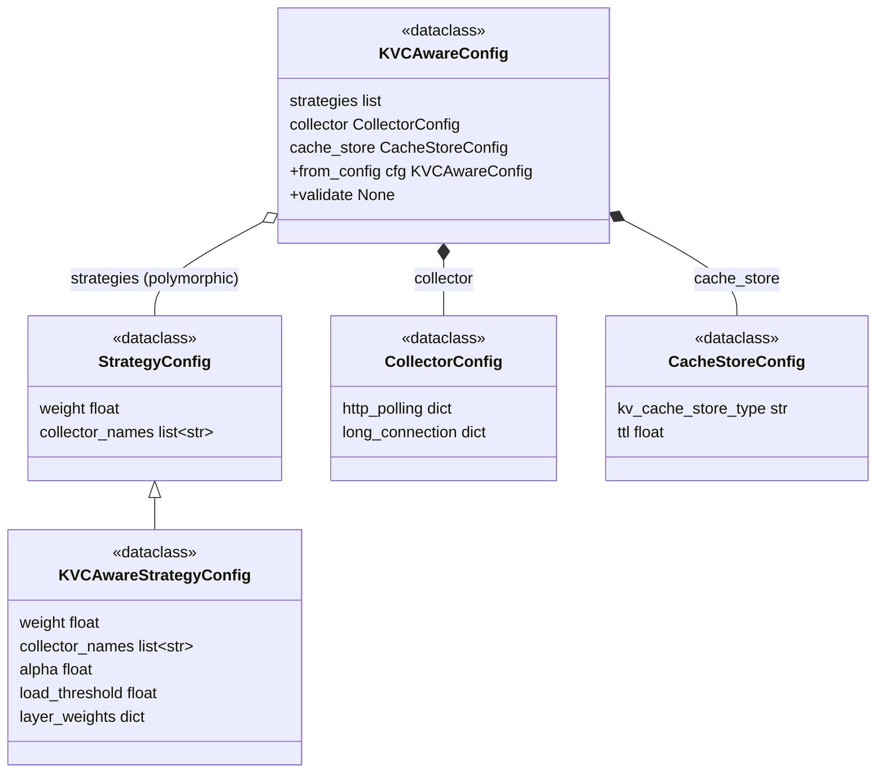

# Config 模块详细设计

> 基于 `overview_arch.md` §4.1 Config 模块，逐模块讨论各模块的配置项与设计决策。

---

## 0 KVCAwareBalancer Drop-in 流程

> 采用与 VeRL `agent_loop_config_path` 相同的 drop-in 模式：从配置路径加载 YAML → `hydra.compose` 展开 `defaults` → VeRL 用 `router_class` + `importlib` 定位 Balancer 类。VeRL 侧只保留 `router_strategy` + `router_config_path`，Balancer 的 FQN 由 YAML 顶层 `router_class` 字段提供，构造参数全部由 YAML 提供。

```
1. VeRL main.yaml:  router.router_strategy=plugin_extension,  router.router_config_path=null
2. Shell 注入:       actor_rollout_ref.rollout.router.router_config_path=${ROUTER_CONFIG_PATH}
                    # ROUTER_CONFIG_PATH 用 pkg:// 协议指向包内配置，如 pkg://uni_agent.llm_router.configs/kvc_aware_router.yaml
3. VeRL 加载并实例化: cfg = hydra.compose(config_name=...)        # 展开 defaults，合并 strategies/collector/cache_store
                    cfg_dict = OmegaConf.to_container(cfg, resolve=True)
                    cls = importlib.import_module(cfg_dict["router_class"])  # 顶层 router_class = Balancer FQN
                    balancer = ray.remote(cls).remote(servers, cfg_dict)
4. Balancer 构造器:  kvc_config = KVCAwareConfig.from_config(cfg_dict)
                    # strategies 按 _target_ instantiate；collector 连接类型参数合并
```

> **关键设计**：
> - **`router_class`（非 `_target_`）标识 Balancer FQN**：VeRL 用 `importlib` 定位类，不走 `hydra.utils.instantiate`。`_target_` 在本体系中只用于子层（strategies）的多态 instantiate，语义统一为"被 `instantiate` 的目标"。
> - **`hydra.compose` 替代 `OmegaConf.load`**：`OmegaConf.load` 不展开 `defaults`，会导致 strategies/collector/cache_store 为空。`hydra.compose` 才能正确组合分层 YAML。
> - **`pkg://` 协议**：`router_config_path` 支持 `pkg://<package>/<rel/path>` 形式，由 VeRL `_resolve_config_path` 解析为包目录绝对路径（兼容普通包与 namespace 目录）。
> - **`router_class` 与 config 域解耦**：`from_config` 只提取 `strategies`/`collector`/`cache_store`，**忽略 `router_class`**——它是 VeRL 侧元数据，不属于 config 域。

---

## 1 各模块配置总览

LLM Router 配置分两层：

- **VeRL RouterConfig**：VeRL 侧只需 `router_strategy` + `router_config_path`，极简配置
- **router YAML**：由 `router_config_path` 指向的 YAML 文件，顶层 `router_class` 指定 Balancer FQN，各模块子配置通过 Hydra `defaults` 分层组合

### 1.1 配置层次

```
VeRL main.yaml（极简 — 只两个字段）
  └─ rollout.router
       ├─ router_strategy: "plugin_extension"
       └─ router_config_path: null  ← 由 shell 脚本注入 YAML 路径（pkg:// 协议）

kvc_aware_router.yaml（由 router_config_path 指向）
  ├─ router_class: "...KVCAwareBalancer"  ← Balancer FQN（VeRL 用 importlib 定位）
  ├─ strategies: ...                  ← 策略配置（分层组合）
  ├─ collector: ...                  ← Collector 连接类型参数
  └─ cache_store: ...                 ← CacheStore 配置
```

### 1.2 VeRL 侧配置注入

VeRL main.yaml 中的 router 配置极简：

```yaml
router:
  router_strategy: plugin_extension
  router_config_path: null    # 由 shell 脚本通过环境变量注入
```

| 配置层 | 字段 | 类型 | 默认值 | 说明 |
|--------|------|------|--------|------|
| **VeRL RouterConfig** | `router_strategy` | `str` | `"global_sticky_inflight"` | 选择路由策略。使用 KVCAwareBalancer 时设为 `"plugin_extension"` |
| **VeRL RouterConfig** | `router_config_path` | `str \| None` | `None` | Router YAML 路径，支持 `pkg://<package>/<rel/path>` 包内路径或文件系统路径；YAML 顶层 `router_class` 指定 Balancer FQN，VeRL 用 `hydra.compose` 展开后传给 Balancer |

> Balancer 须作为 Ray actor 运行（多个 AgentLoopWorker 共享同一实例）。VeRL 侧的具体改动与实现方式见 §0。

---

## 2 YAML 配置分层与组合策略

### 2.1 设计原则

> **核心思路**：拆分 YAML 文件，用户根据使用深度，在某一层次覆盖默认配置项即可，而不需要指定每个策略的所有配置项。类似 VeRL `ppo_megatron_trainer.yaml` 中的 `defaults` 层层引用模式。

YAML 分三层：
1. **策略层**（strategy YAML）：每个策略独立一个 YAML 文件，包含策略参数 + 绑定的 collector 名称
2. **Collector 层**（collector.yaml 单文件）：连接类型参数（http_polling / long_connection）
3. **Router 层**（router YAML）：组合策略 + collector + cache_store，作为顶层入口

### 2.2 策略绑定 Collector

策略 YAML 中声明 `collector_names` 字段（`list[str]`），值为该策略需要的 collector 名称。tuning 参数（polling_interval、retry delays 等）按连接类型统一放在 `CollectorConfig.http_polling` / `long_connection` dict 中，策略不直接配置 collector 参数。

### 2.3 YAML 文件结构

```
uni_agent/llm_router/configs/
├── kvc_aware_router.yaml           # 顶层 router 入口
├── collector.yaml                  # 连接类型参数（根单文件）
├── cache_store.yaml                # CacheStore 配置（根单文件）
└── strategies/
    └── kvc_aware_strategy.yaml     # KVCAware 策略配置
```

### 2.4 Hydra defaults 语法（对齐 VeRL）

> router.yaml 顶层引用各模块时，按场景选用 Hydra defaults 语法，与 VeRL `ppo_trainer.yaml` 风格对齐：

| 场景 | 语法 | 本项目用法 | VeRL 对应 |
|------|------|-----------|----------|
| 顶层引用 group、需指定具体 config + 落点 | `group@package: config`（三段式） | `- strategies@strategies.kvc_aware_strategy: kvc_aware_strategy` | `- actor@actor_rollout_ref.actor: ${model_engine}_actor` |
| 根单文件、放到指定 package | `config@package`（二段式） | `- collector@collector` / `- cache_store@cache_store` | —（VeRL 无此场景） |

---

## 3 Router YAML 各模块配置项定义

### 3.1 Balancer

Balancer FQN 由 router YAML 顶层 `router_class` 字段提供，构造参数由各模块子配置提供。VeRL 用 `importlib` 定位 `router_class` 指向的类，不走 `hydra.utils.instantiate`。

| 配置层 | 字段 | 类型 | 默认值 | 说明 |
|--------|------|------|--------|------|
| **VeRL RouterConfig** | `router_strategy` | `str` | `"global_sticky_inflight"` | 选择路由策略 |
| **VeRL RouterConfig** | `router_config_path` | `str \| None` | `None` | Router YAML 路径（`pkg://` 或文件系统路径），VeRL 用 `hydra.compose` 展开 `defaults` |
| **router YAML** | `router_class` | `str` | `"uni_agent.llm_router.balancer.KVCAwareBalancer"` | Balancer FQN，VeRL 用 `importlib` 定位（`from_config` 忽略此字段） |

### 3.2 Strategy

Strategy 配置在 router YAML 中通过 `strategies` 定义，每条策略为带 `_target_` 的多态条目，由 Hydra `defaults` 分层组合引入。

#### 3.2.1 策略列表结构（所有策略共享）

| 字段 | 类型 | 约束 | 说明 |
|------|------|------|------|
| `_target_` | `str` | FQN，继承 StrategyConfig | 策略 dataclass 的完整类路径 |
| `weight` | `float` | 0 < weight ≤ 1，所有策略 Σ ≈ 1.0 | 多策略加权系数 |
| `collector_names` | `list[str]` | 必填 | 绑定的 collector 名称列表 |

#### 3.2.2 KVCAwareStrategy kwargs

| 参数 | 默认值 | 类型 | 说明 |
|------|--------|------|------|
| `weight` | — | `float` | 必填，多策略加权系数 |
| `alpha` | `0.7` | `float` | cache vs load 内部权重，`S = α × S_cache + (1-α) × S_load` |
| `load_threshold` | `80` | `float` | 过载阈值（百分比），load ≥ threshold → -1 黑名单 |
| `layer_weights` | `{cpu: 1.0, ssd: 0.25}` | `dict[str, float]` | 慢路径层级权重，键固定 cpu/ssd |
| `collector_names` | `[]` | `list[str]` | 绑定的 collector 名称列表 |

> **⚠️ 遗留问题 1**：`load_threshold` 涉及 `gpu_utilization` 和 `queue_depth` 的归一化。`gpu_utilization` vLLM 本身给出百分比（/100 即归一化），但 `queue_depth`（`num_requests_waiting`）是原始整数，归一化需要基准值。是否需要新增 `max_queue_depth` 配置项，或从 vLLM 指标自动获取，待 Metrics 模块设计后再确定。

> **⚠️ 遗留问题 2**：Strategy 是否需要在配置中声明依赖哪些指标（如 `gpu_prefix_hit_rate`、`tier_prefix_hit_rate`、`gpu_utilization`、`queue_depth`），以及 Metrics 模块如何提供「当前可提供哪些指标」的信息，待 Metrics 模块设计后再确定。

### 3.3 Collector

Collector 配置在 router YAML 中通过 `collector` 字段定义，包含 `http_polling`/`long_connection` 连接类型配置 dict。由 Hydra `defaults` 分层组合引入。

#### 3.3.1 Collector 连接类型配置

Tuning 参数按连接类型分组为两个 plain dict，同一类型所有 collector 共享；未来可按需在 dict 中新增参数，不影响数据类结构。

**http_polling（HTTP 轮询类，Prometheus scrape 等）**

| 参数 | 默认值 | 类型 | 说明 |
|------|--------|------|------|
| `polling_interval` | `5.0` | `float` | 两次 HTTP scrape 间隔（秒） |
| `http_timeout` | `10.0` | `float` | 单次 HTTP 请求超时（秒） |

**long_connection（长连接类，ZMQ PUB/SUB 等）**

| 参数 | 默认值 | 类型 | 说明 |
|------|--------|------|------|
| `base_retry_delay` | `1.0` | `float` | 首次重试延迟（秒），指数退避起始值 |
| `max_retry_delay` | `30.0` | `float` | 最大重试延迟上限（秒） |
| `max_retry_attempts` | `5` | `int` | 最大连续重试次数 |
| `retry_backoff_factor` | `2.0` | `float` | 指数退避乘数因子 |

**通用字段**

无。CollectorConfig 目前只含 `http_polling` 和 `long_connection` 两个 dict。
### 3.4 CacheStore

CacheStore 配置在 router YAML 中通过 `cache_store` 字段定义。CacheStore 是被动存储层，写入由各 collector 驱动，对外提供查询接口。

#### 3.4.1 CacheStore 配置项

| 参数 | 默认值 | 类型 | 说明 |
|------|--------|------|------|
| `kv_cache_store_type` | `list` | `str` | KVCacheIndex 存储结构类型，可选 `list` / `radix_tree` 等 |
| `ttl` | `30` | `float` | 数据新鲜度阈值（秒），超过此时间的 ReplicaMetrics 视为过期 |

> **⚠️ 遗留问题 5**：`kv_cache_store_type` 的可选值和各类型的具体性能特征，待 Cache 模块详细设计中进一步调研。

---

## 4 Config 数据类类图与解析策略

### 4.1 模块文件结构

> py schema 全部集中到 `config/` 包（对齐 VeRL `workers/config/`），与 runtime 模块分目录。`config/` 包内一个组件一个文件，**不 import 任何 runtime 类**；runtime 模块（`strategies/`、`metrics/`、`cache/`、`balancer`）单向 import `config/`，YAML 的 `_target_` FQN 指向 `config/` 包内各 dataclass。
>
> 依赖方向：runtime → `config/`（单向，无循环）。`config/__init__.py` 聚合 re-export 全部 config 类。

```
uni_agent/llm_router/
├── config/                       # py schema（对齐 VeRL workers/config/，纯 dataclass，不 import runtime）
│   ├── __init__.py               # 聚合 re-export 全部 config 类
│   ├── base.py                   # ConfigError, StrategyConfig, _multiline_repr
│   ├── strategy.py               # KVCAwareStrategyConfig
│   ├── collector.py              # CollectorConfig（http_polling/long_connection 连接类型参数）
│   ├── cache.py                  # CacheStoreConfig
│   └── router.py                 # KVCAwareConfig, from_config
├── configs/                      # YAML 配置文件分层目录
│   ├── kvc_aware_router.yaml     # 顶层 router 入口
│   ├── collector.yaml            # Collector 连接类型参数（根单文件）
│   ├── cache_store.yaml          # CacheStore 配置（根单文件）
│   └── strategies/
│       └── kvc_aware_strategy.yaml
├── strategies/                   # runtime：KVCAwareStrategy 等（待实现）
├── metrics/                      # runtime：collectors（待实现）
├── cache/                        # runtime：CacheStore（待实现）
└── balancer.py                   # runtime：KVCAwareBalancer（待实现）
```

### 4.2 解析策略

> `from_config()` 从 VeRL 传入的 OmegaConf DictConfig 解析为 `KVCAwareConfig` dataclass 实例，分两步：
>
> 1. 顶层用 `OmegaConf.merge(defaults, cfg)` 自动合并 dataclass 类型标注的字段（collector/cache_store），collector 中 `http_polling` / `long_connection` plain dict 自动合并
> 2. 遍历 strategies（list 或 Hydra defaults 组合产生的 dict），对每个 `_target_` 条目调用 `hydra.instantiate` 解析为具体 StrategyConfig dataclass 实例

### 4.3 数据类类图



#### KVCAwareConfig

| 字段 | 类型 | 合法性约束 | 说明 |
|------|------|------------|------|
| `strategies` | `list[StrategyConfig]` | 非空；Σ weight ≈ 1.0；必填 | 策略列表（多态） |
| `collector` | `CollectorConfig` | 无 | 连接类型参数 |
| `cache_store` | `CacheStoreConfig` | 无 | CacheStore 配置 |

#### StrategyConfig（基类）

| 字段 | 类型 | 合法性约束 | 说明 |
|------|------|------------|------|
| `weight` | `float` | 0 < weight ≤ 1 | 多策略加权系数 |
| `collector_names` | `list[str]` | 必填 | 绑定的 collector 名称列表 |

#### KVCAwareStrategyConfig

| 字段 | 类型 | 合法性约束 | 默认值 | 说明 |
|------|------|------------|--------|------|
| `weight` | `float` | 0 < weight ≤ 1 | — | 继承自 StrategyConfig |
| `collector_names` | `list[str]` | 默认 `[]` | `[]` | 继承自 StrategyConfig |
| `alpha` | `float` | 无 | `0.7` | cache vs load 内部权重 |
| `load_threshold` | `float` | > 0 | `80` | 过载阈值（百分比） |
| `layer_weights` | `dict[str, float]` | 键固定 cpu/ssd | `{cpu: 1.0, ssd: 0.25}` | 慢路径层级权重 |

#### CollectorConfig

| 字段 | 类型 | 合法性约束 | 默认值 | 说明 |
|------|------|------------|--------|------|
| `http_polling` | `dict[str, float]` | polling_interval > 0, http_timeout > 0 | `{polling_interval:5.0, http_timeout:10.0}` | HTTP 轮询连接参数 dict（可扩展） |
| `long_connection` | `dict[str, float|int]` | base_retry_delay > 0, max_retry_delay ≥ base_retry_delay, max_retry_attempts ≥ 1, retry_backoff_factor > 0 | `{base_retry_delay:1.0, max_retry_delay:30.0, max_retry_attempts:5, retry_backoff_factor:2.0}` | 长连接参数 dict（可扩展） |

#### CacheStoreConfig

| 字段 | 类型 | 合法性约束 | 默认值 | 说明 |
|------|------|------------|--------|------|
| `kv_cache_store_type` | `str` | 已注册的存储类型名 | `"list"` | KVCacheIndex 存储结构类型 |
| `ttl` | `float` | > 0 | `30.0` | 数据新鲜度阈值（秒） |

### 4.4 YAML 配置样例

#### kvc_aware_strategy.yaml

```yaml
# strategies/kvc_aware_strategy.yaml
_target_: uni_agent.llm_router.config.strategy.KVCAwareStrategyConfig
weight: 1.0
alpha: 0.7
load_threshold: 80
layer_weights:
    cpu: 1.0
    ssd: 0.25
collector_names:
    - vllm_zmq
    - mooncake_prometheus
```

#### kvc_aware_strategy2.yaml（示例：不同策略绑定不同 collector）

```yaml
# strategies/kvc_aware_strategy2.yaml
_target_: uni_agent.llm_router.config.strategy.KVCAwareStrategyConfig
weight: 1.0
alpha: 0.5
load_threshold: 90
layer_weights:
    cpu: 1.0
    ssd: 0.25
collector_names:
    - vllm_prometheus
    - mooncake_prometheus
```

#### collector.yaml

```yaml
# configs/collector.yaml — 连接类型参数
http_polling:
    polling_interval: 5
    http_timeout: 10

long_connection:
    base_retry_delay: 1.0
    max_retry_delay: 30.0
    max_retry_attempts: 5
    retry_backoff_factor: 2.0
```

#### cache_store.yaml（根单文件）

```yaml
# configs/cache_store.yaml — CacheStore 配置（进程级共享单例，被 strategy 查询、collectors 写入）
kv_cache_store_type: list
ttl: 30
```

#### kvc_aware_router.yaml（顶层入口）

```yaml
# configs/kvc_aware_router.yaml — 顶层 router 入口
# strategies 是 group（多 config）用三段式 group 引用；collector/cache_store 是根单文件用二段式 config@package。
defaults:
    - strategies@strategies.kvc_aware_strategy: kvc_aware_strategy   # 三段式：group 多 config 选一个
    - collector@collector                                             # 根单文件，@collector 指定落点
    - cache_store@cache_store                                         # 根单文件，@cache_store 指定落点
    - _self_

router_class: uni_agent.llm_router.balancer.KVCAwareBalancer    # Balancer FQN（VeRL 用 importlib 定位）

strategies:
    kvc_aware_strategy:
        weight: 1.0       # 可在此覆盖策略的 weight
```

> **用户使用示例**：
>
> 默认使用：直接指定 `kvc_aware_router.yaml`，所有默认值生效。
>
> 覆盖策略 weight：在 `kvc_aware_router.yaml` 的 `strategies.kvc_aware_strategy.weight` 改值，或通过 `hydra.compose` overrides 传入。
>
> 覆盖连接参数：在 `collector.yaml` 中直接改 `http_polling` / `long_connection`，或通过 `hydra.compose` overrides（如 `collector.http_polling.polling_interval=3`）传入。
>
> 多策略加权：在 `kvc_aware_router.yaml` 的 defaults 中新增第二条策略引用，覆盖各策略 weight 使 Σ ≈ 1.0。

#### VeRL 侧注入

```yaml
# VeRL main.yaml 中 router 配置 — 极简，只两个字段
router:
  router_strategy: plugin_extension
  router_config_path: null    # 由 shell 脚本通过环境变量注入
```

```bash
# Shell 脚本中的注入方式（pkg:// 协议指向包内配置）
ROUTER_CONFIG_PATH=${ROUTER_CONFIG_PATH:-"pkg://uni_agent.llm_router.configs/kvc_aware_router.yaml"}

python3 -m verl.trainer.main \
    --config-name='ppo_megatron_trainer.yaml' \
    actor_rollout_ref.rollout.router.router_config_path=${ROUTER_CONFIG_PATH}
```

> `pkg://` 协议由 VeRL `_resolve_config_path` 解析：`pkg://uni_agent.llm_router.configs/kvc_aware_router.yaml` → `<site-packages>/uni_agent/llm_router/configs/kvc_aware_router.yaml`。也支持绝对/相对文件系统路径（非 `pkg://` 前缀即按文件系统处理）。

### 4.5 解析结果

```python
KVCAwareConfig(
    strategies=[
        KVCAwareStrategyConfig(
            weight=1.0, alpha=0.7, load_threshold=80,
            layer_weights={"cpu": 1.0, "ssd": 0.25},
            collector_names=["vllm_zmq", "mooncake_prometheus"]
        )
    ],
    collector=CollectorConfig(
        http_polling={"polling_interval": 5.0, "http_timeout": 10.0},
        long_connection={"base_retry_delay": 1.0, "max_retry_delay": 30.0,
                         "max_retry_attempts": 5, "retry_backoff_factor": 2.0}
    ),
    cache_store=CacheStoreConfig(kv_cache_store_type="list", ttl=30.0)
)
```

### 4.6 `__repr__` 多行设计

> 所有 config dataclass 共用一个 `_multiline_repr(obj, indent)` 辅助函数（置于 `config/base.py`），通过 `@dataclass(repr=False)` + `__repr__ = _multiline_repr` 挂载到每个 config 基类（子类继承）。
>
> - **多行缩进**：每个字段独占一行，嵌套 dataclass/list/dict 递归加深缩进，形成可读树状结构（避免 dataclass 默认 repr 挤成难以阅读的单行）。
> - **尊重 `field(repr=False)`**：遍历 `dataclasses.fields(obj)` 时跳过 `f.repr == False` 的字段。

---

## 5 测试用例规格

> 每个模块的用例分为五类：①输入输出正常用例；②输入输出异常用例；③Hydra 解析正常用例；④Hydra 解析异常用例；⑤其他用例。
>
> 输入格式为 OmegaConf DictConfig（模拟 VeRL 从 router_config_path 加载后传入 Balancer 的配置），strategies 中每个条目带 `_target_`。策略字段名为 `collector_names`（绑定 collector 名称），聚合配置字段名为 `collector`（CollectorConfig，含 `http_polling`/`long_connection` 连接类型参数）。
>
> **实现位置**：§5.1–§5.4 的 S/M/C/K 用例实现于 `tests/uni_agent/llm_router/test_config.py`；§5.5 的 D 用例跨 verl 侧（`_resolve_config_path` / `_resolve_router_class`，在 `verl/tests/workers/rollout/test_router.py`）与 config 侧（`from_config` 行为，在 `tests/uni_agent/llm_router/test_config.py`），见各表「测试位置」列。

### 5.1 StrategyConfig / KVCAwareStrategyConfig

#### ① 输入输出正常用例

| ID | 测试场景 | 输入 | 预期结果 |
|----|----------|------|----------|
| S01 | weight = 1.0 | `{"weight": 1.0, "collector_names": ["vllm_zmq"]}` | 正常解析 |
| S02 | weight = 0.7 | `{"weight": 0.7, "collector_names": ["vllm_zmq"]}` | 正常解析 |
| S03 | alpha = 0.7 | `{"weight": 1.0, "alpha": 0.7, "collector_names": ["vllm_zmq"]}` | 正常解析 |
| S04 | alpha = 0.0 | `{"weight": 1.0, "alpha": 0.0, "collector_names": ["vllm_zmq"]}` | cache 权重为 0，纯 load 打分 |
| S05 | alpha = 1.0 | `{"weight": 1.0, "alpha": 1.0, "collector_names": ["vllm_zmq"]}` | load 权重为 0，纯 cache 打分 |
| S06 | alpha 缺失 → 默认值 0.7 | `{"weight": 1.0, "collector_names": ["vllm_zmq"]}` | alpha = 0.7 |
| S07 | load_threshold = 80 | `{"weight": 1.0, "load_threshold": 80, "collector_names": ["vllm_zmq"]}` | 正常解析 |
| S08 | load_threshold 缺失 → 默认值 80 | `{"weight": 1.0, "collector_names": ["vllm_zmq"]}` | load_threshold = 80 |
| S09 | layer_weights = {cpu: 1.0, ssd: 0.25} | `{"weight": 1.0, "layer_weights": {"cpu": 1.0, "ssd": 0.25}, "collector_names": ["vllm_zmq"]}` | 正常解析 |
| S10 | layer_weights 缺失 → 默认值 | `{"weight": 1.0, "collector_names": ["vllm_zmq"]}` | layer_weights = {cpu: 1.0, ssd: 0.25} |
| S11 | collector_names 绑定多个 collector | `{"weight": 1.0, "collector_names": ["vllm_zmq", "mooncake_prometheus"]}` | collector_names 列表长度为 2 |
| S12 | 多策略 Σ weight ≈ 1.0 | 两条 strategy: weight=0.6+0.4 | 正常解析 |

#### ② 输入输出异常用例

| ID | 测试场景 | 输入 | 预期结果 |
|----|----------|------|----------|
| S13 | weight = 0 | `{"weight": 0, "collector_names": ["vllm_zmq"]}` | ConfigError: weight must be in (0, 1] |
| S14 | weight > 1 | `{"weight": 1.5, "collector_names": ["vllm_zmq"]}` | ConfigError: weight must be in (0, 1] |
| S15 | weight < 0 | `{"weight": -1, "collector_names": ["vllm_zmq"]}` | ConfigError: weight must be in (0, 1] |
| S16 | weight 为字符串 | `{"weight": "0.7", "collector_names": ["vllm_zmq"]}` | 类型错误 |
| S17 | weight 缺失（必填字段） | `{"collector_names": ["vllm_zmq"]}` | TypeError: missing required argument |
| S18 | load_threshold = 0 | `{"weight": 1.0, "load_threshold": 0, "collector_names": ["vllm_zmq"]}` | ConfigError: load_threshold must be > 0 |
| S19 | load_threshold < 0 | `{"weight": 1.0, "load_threshold": -1, "collector_names": ["vllm_zmq"]}` | ConfigError: load_threshold must be > 0 |
| S20 | layer_weights 含非 cpu/ssd 键 | `{"weight": 1.0, "layer_weights": {"cpu": 1.0, "disk": 0.5}, "collector_names": ["vllm_zmq"]}` | ConfigError: layer_weights keys must be cpu/ssd only |
| S21 | layer_weights 缺少 cpu 或 ssd | `{"weight": 1.0, "layer_weights": {"cpu": 1.0}, "collector_names": ["vllm_zmq"]}` | ConfigError: layer_weights must contain cpu and ssd |
| S22 | collector_names 缺失（必填字段） | `{"weight": 1.0}` | TypeError: missing required argument |
| S23 | collector_names 为非 list 类型 | `{"weight": 1.0, "collector_names": "vllm_zmq"}` | ConfigError: collector_names must be a list |
| S24 | 多策略 Σ weight ≠ 1.0 | 两条 strategy: weight=0.4+0.4 | ConfigError: sum of weights must be ~1.0 |
| S25 | strategies 为空列表 | `{"strategies": []}` | ConfigError: strategies 非空 |
| S26 | strategies 不是 list/dict | `{"strategies": "kvc_aware"}` | ConfigError: strategies must be a list or dict |
| S27 | strategy item 不是 dict | `{"strategies": ["kvc_aware"]}` | ConfigError: strategies[i] must be a dict |

#### ③ Hydra 解析正常用例

| ID | 测试场景 | 输入 | 预期结果 |
|----|----------|------|----------|
| S28 | strategy 带 `_target_` instantiate 为 KVCAwareStrategyConfig | `{"_target_": "...KVCAwareStrategyConfig", "weight": 1.0, "collector_names": ["vllm_zmq"]}` | `type(result) == KVCAwareStrategyConfig` |
| S29 | instantiate 后可通过基类访问 weight 和 collector_names | KVCAwareStrategyConfig 实例 | `result.weight == 1.0`，`isinstance(result, StrategyConfig)`，`result.collector_names == ["vllm_zmq"]` |
| S30 | instantiate 默认值填充 | `{"_target_": "...KVCAwareStrategyConfig", "weight": 1.0, "collector_names": ["vllm_zmq"]}` | alpha=0.7, load_threshold=80, layer_weights={cpu:1.0, ssd:0.25} |

#### ④ Hydra 解析异常用例

| ID | 测试场景 | 输入 | 预期结果 |
|----|----------|------|----------|
| S31 | `_target_` FQN 模块不存在 | `{"_target_": "nonexistent.Module.Class"}` | ImportError |
| S32 | `_target_` FQN 类不存在 | `{"_target_": "uni_agent.llm_router.strategies.NonExistClass"}` | AttributeError |
| S33 | `_target_` 缺失 | `{"weight": 1.0}`（无 `_target_`） | instantiate 报错 |
| S34 | `_target_` 指向非 StrategyConfig 子类 | `{"_target_": "...SomeOtherConfig", "weight": 1.0}` | ConfigError: must inherit StrategyConfig |
| S35 | `_target_` 指向非 dataclass | `{"_target_": "...some_function"}` | TypeError |

#### ⑤ 其他用例

| ID | 测试场景 | 输入 | 预期结果 |
|----|----------|------|----------|
| S36 | 空 config → strategies 缺失 | `{}` | ConfigError: strategies is required |
| S37 | strategies 为 null → 缺失 | `{"strategies": None}` | ConfigError: strategies is required |

### 5.2 CollectorConfig

#### ① 输入输出正常用例

| ID | 测试场景 | 输入 | 预期结果 |
|----|----------|------|----------|
| M01 | CollectorConfig() → http_polling 默认值 | `{}` | http_polling = {polling_interval:5.0, http_timeout:10.0} |
| M02 | http_polling 自定义值 | `{http_polling: {polling_interval:3.0, http_timeout:15.0}}` | http_polling 字段覆盖 |
| M03 | CollectorConfig() → long_connection 默认值 | `{}` | long_connection = {base_retry_delay:1.0, ...} |
| M04 | long_connection 自定义值 | `{long_connection: {base_retry_delay:2.0, ...}}` | long_connection 字段覆盖 |
| M05 | CollectorConfig 字段集 | — | dataclasses.fields(CollectorConfig) = {http_polling, long_connection} |
| M06 | CollectorConfig 是 dataclass | — | is_dataclass(CollectorConfig) = True |

#### ② 输入输出异常用例

| ID | 测试场景 | 输入 | 预期结果 |
|----|----------|------|----------|
| M10 | polling_interval = 0 | `{http_polling: {polling_interval:0, http_timeout:10}}` | ConfigError |
| M11 | polling_interval < 0 | `{http_polling: {polling_interval:-1, http_timeout:10}}` | ConfigError |
| M12 | http_timeout = 0 | `{http_polling: {polling_interval:5, http_timeout:0}}` | ConfigError |
| M13 | base_retry_delay < 0 | `{long_connection: {base_retry_delay:-1}}` | ConfigError |
| M14 | max_retry_delay < base_retry_delay | `{long_connection: {base_retry_delay:5, max_retry_delay:3}}` | ConfigError |
| M15 | max_retry_attempts = 0 | `{long_connection: {max_retry_attempts:0}}` | ConfigError |
| M16 | retry_backoff_factor < 0 | `{long_connection: {retry_backoff_factor:-1}}` | ConfigError |

#### ③ ④ Hydra 解析正常/异常用例

无。CollectorConfig 不含 polymorphic `_target_`，由 OmegaConf.merge 自动递归解析。

#### ⑤ 其他用例

| ID | 测试场景 | 输入 | 预期结果 |
|----|----------|------|----------|
| M18 | 仅 strategies → collector 默认值 | `{strategies: [...]}` | http_polling/long_connection 默认值 |
| M19 | collector 为 null → 默认值 | `{strategies: [...], collector: null}` | CollectorConfig 默认值 |
| M20 | http_polling 覆盖默认值 | `{collector: {http_polling: {polling_interval:3}}}` | http_polling.polling_interval = 3.0 |

### 5.3 CacheStoreConfig

#### ① 输入输出正常用例

| ID | 测试场景 | 输入 | 预期结果 |
|----|----------|------|----------|
| C01 | kv_cache_store_type = list | `{"kv_cache_store_type": "list"}` | 正常解析 |
| C02 | kv_cache_store_type = radix_tree | `{"kv_cache_store_type": "radix_tree"}` | 正常解析 |
| C03 | kv_cache_store_type 缺失 → 默认值 list | `{}` | kv_cache_store_type = "list" |
| C04 | ttl = 30.0 | `{"ttl": 30.0}` | 正常解析 |
| C05 | ttl 缺失 → 默认值 30.0 | `{}` | ttl = 30.0 |

#### ② 输入输出异常用例

| ID | 测试场景 | 输入 | 预期结果 |
|----|----------|------|----------|
| C06 | kv_cache_store_type = unknown | `{"kv_cache_store_type": "unknown"}` | ConfigError: unknown store type |
| C07 | ttl = 0 | `{"ttl": 0}` | ConfigError: ttl must be > 0 |
| C08 | ttl < 0 | `{"ttl": -1}` | ConfigError: ttl must be > 0 |
| C09 | cache_store 不是 dict | `{"cache_store": "list"}` | ConfigError: cache_store must be a dict |

#### ③ Hydra 解析正常用例

无。CacheStoreConfig 不含 `_target_`，由 `OmegaConf.merge` 通过 `KVCAwareConfig` 自动递归解析，无需单独 instantiate。

#### ④ Hydra 解析异常用例

无。CacheStoreConfig 结构固定（不含 polymorphic），不涉及 `_target_` instantiate。

#### ⑤ 其他用例

| ID | 测试场景 | 输入 | 预期结果 |
|----|----------|------|----------|
| C10 | 仅 strategies → cache_store 默认值 | `{"strategies": [...]}` | kv_cache_store_type="list", ttl=30.0 |
| C11 | strategies + cache_store 为 null → 默认值 | `{"strategies": [...], "cache_store": None}` | CacheStoreConfig 默认值 |

### 5.4 KVCAwareConfig 顶层

#### ① 输入输出正常用例

| ID | 测试场景 | 输入 | 预期结果 |
|----|----------|------|----------|
| K01 | 完整 config → 正常解析 | 含 strategies + collector + cache_store 的完整 OmegaConf | 各字段按输入值解析 |

#### ② 输入输出异常用例

| ID | 测试场景 | 输入 | 预期结果 |
|----|----------|------|----------|
| K02 | 多错误聚合 | strategies 空列表 + polling_interval=-1 + ttl=0 | ConfigError 包含所有错误信息 |
| K03 | collector 不是 dict | `{"strategies": [...], "collector": "vllm"}` | ConfigError: collector must be a dict |

#### ③ Hydra 解析正常用例

| ID | 测试场景 | 输入 | 预期结果 |
|----|----------|------|----------|
| K05 | 顶层 OmegaConf.merge → KVCAwareConfig | 完整 OmegaConf config | KVCAwareConfig 实例 |
| K06 | collector 自动递归解析为 CollectorConfig | 含 collector 的 OmegaConf | http_polling/long_connection 字段正确 |
| K07 | cache_store 自动递归解析为 CacheStoreConfig | 含 cache_store 的 OmegaConf | kv_cache_store_type/ttl 正确 |
| K08 | strategies dict → list 转换 | `{"strategies": {"kvc_aware": {_target_: ..., weight: 1.0}}}` | from_config 转换后 strategies 为 list[StrategyConfig] |

#### ④ Hydra 解析异常用例

| ID | 测试场景 | 输入 | 预期结果 |
|----|----------|------|----------|
| K09 | 顶层含 `router_class` → from_config 忽略 | YAML 含顶层 `router_class` | KVCAwareConfig 正常解析，`router_class` 不出现在结果中 |
| K10 | collector 含未定义 key | `{"collector": {"unknown_key": 123}}` | OmegaConf ConfigKeyError |
| K11 | `__repr__` 多行缩进 | 完整 config | repr 多行、含 weight/collector_names |

#### ⑤ 其他用例

| ID | 测试场景 | 输入 | 预期结果 |
|----|----------|------|----------|
| K12 | 仅 strategies → collector/cache_store 默认值 | `{"strategies": [...]}` | collector 和 cache_store 为默认值 |
| K13 | strategies instantiate 后变为 dataclass | 遍历 strategies 逐个 instantiate | 所有条目为 KVCAwareStrategyConfig 实例 |
| K14 | Hydra 递归组合 → from_config 完整校验 | hydra.compose → from_config | strategies dict→list、http_polling/long_connection 参数、cache_store 全部正确 |

### 5.5 Drop-in 流程集成测试

> VeRL drop-in：`hydra.compose` → `router_class` → `importlib` → `ray.remote` → `from_config`。
> D01-D04/D06-D07 在 verl 侧 (`verl/tests/workers/rollout/test_router.py`)；D05/D08-D13 在 config 侧 (`tests/uni_agent/llm_router/test_config.py`)。

| ID | 测试场景 | 测试位置 | 预期结果 |
|----|----------|----------|----------|
| D01 | `pkg://` 路径解析 | verl | 返回绝对路径，文件存在 |
| D02 | `pkg://` 缺相对路径 → ValueError | verl | 抛 ValueError |
| D03 | `pkg://` 包不存在 → ImportError | verl | 抛 ImportError |
| D04 | 非 `pkg://` 按文件系统处理 | verl | 绝对路径原样返回 |
| D05 | `hydra.compose` 展开 defaults | config | 含 strategies/collector/cache_store + router_class |
| D06 | VeRL 读 `router_class` → `importlib` 定位类 | verl | 返回类对象 |
| D07 | 缺 `router_class` → ValueError | verl | 抛 ValueError |
| D08 | Balancer 构造器 → `from_config` | config | 完整 `KVCAwareConfig` 实例 |
| D09 | strategy 带子层 `_target_` → instantiate | config | `type(result.strategies[0]) == KVCAwareStrategyConfig` |
| D11 | `from_config` 忽略 `router_class` | config | `KVCAwareConfig` 无 `router_class` 字段 |
| D12 | OmegaConf DictConfig 输入 → 正常 | config | 正常解析 |
| D13 | 普通 dict 输入 → 正常 | config | 正常解析 |