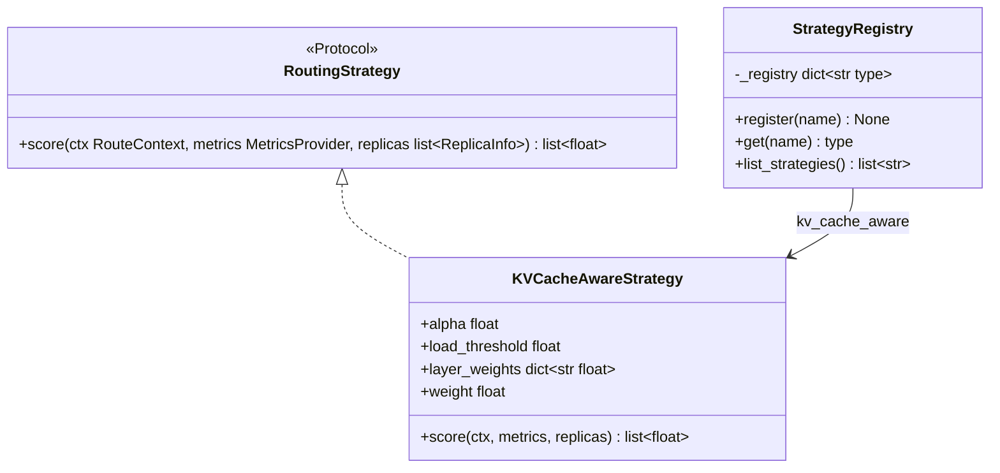
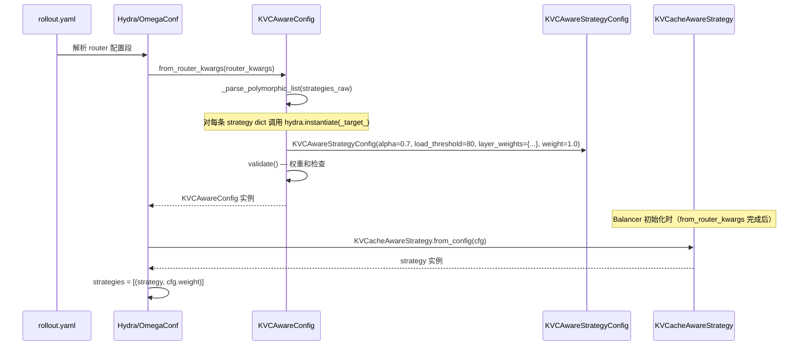
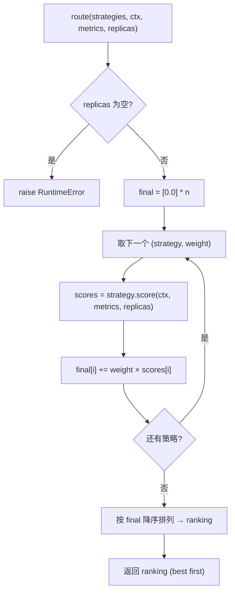
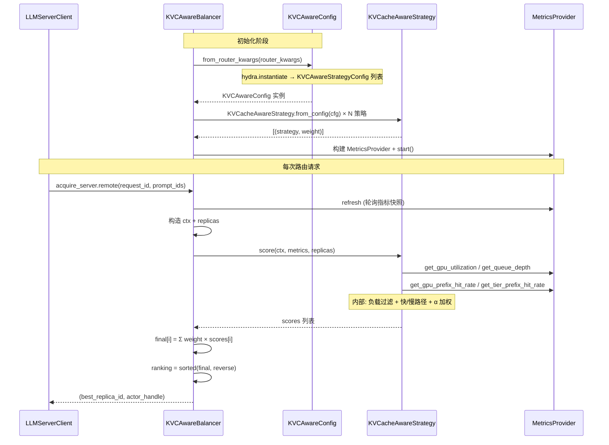
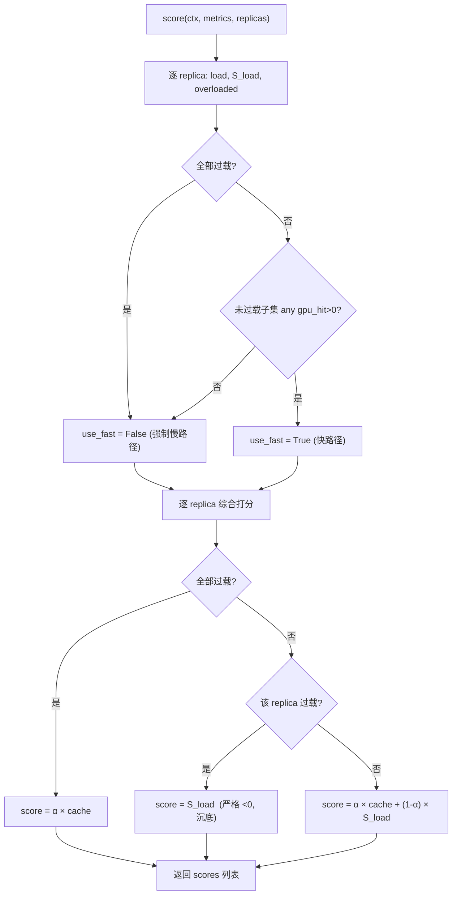

# Strategy 模块详细设计

> 细化 LLM Router 的路由策略层：`RoutingStrategy` 接口、`StrategyRegistry` 注册表、纯加权求和的组合框架，以及内置策略 `KVCacheAwareStrategy`（单策略封装负载过滤与快/慢路径 prefix cache 打分）。
>
> 设计采用 **组合框架纯加权求和 + 单策略内聚业务逻辑** 的方案：组合框架只做「各策略独立打分 → 加权求和 → 排序」；负载、过载过滤、快/慢路径分叉等 KVC 业务逻辑全部内聚在 `KVCacheAwareStrategy` 内部，对组合框架透明。

---

## 1 职责边界

Strategy 模块负责：

1. **接口定义**：定义统一的打分接口 `RoutingStrategy`，所有内置或用户自定义策略均满足此接口。
2. **注册表**：提供 `StrategyRegistry`，支持按名称注册与查找策略类。
3. **组合框架**：定义多策略加权求和、排序输出的 `route()` 函数。
4. **内置策略**：实现 `KVCacheAwareStrategy`，单策略内部封装负载打分、过载过滤、快/慢路径 prefix cache 打分。

Strategy 模块 **不负责**：

- 路由决策的最终落地与 server handle 管理（由 Balancer 负责）。
- 指标采集与网络连接（由 Metrics 模块负责，策略通过 `MetricsProvider` 只读查询）。
- 配置解析与校验（由 Config 模块负责）。

---

## 2 策略接口定义（RoutingStrategy Protocol）

### 2.1 接口签名

使用 Python `typing.Protocol` 定义结构子类型，策略实现无需显式继承：

```python
from typing import Protocol


class RoutingStrategy(Protocol):
    """路由打分策略接口。

    每个策略独立地对一批 replica 打分，输出与 replicas 等长、顺序一致的得分列表。
    组合框架对各策略的输出加权求和，得到最终排序。
    """

    def score(
        self,
        ctx: "RouteContext",            # uni-agent 侧 llm_router/types.py
        metrics: "MetricsProvider",     # uni-agent 侧 llm_router/types.py
        replicas: list["ReplicaInfo"],  # uni-agent 侧 llm_router/types.py
    ) -> list[float]:
        """对每个 replica 独立打分。

        Args:
            ctx: 单次路由请求上下文（request_id + prompt_ids）。
            metrics: 统一指标查询入口，策略通过它只读获取运行时数据。
            replicas: 参与本次路由的 replica 列表。

        Returns:
            与 replicas 等长且顺序一致的得分列表。得分越大越优；策略可返回
            负分表示该 replica 不被推荐（组合框架不对负分做特殊处理，仅参与加权求和）。
        """
        ...
```

### 2.2 类型来源对照表

下表列出本模块依赖的外部类型及其定义位置：

| 类型 | 来源 | 字段 / 关键方法 | 定义文档 |
|------|------|-----------------|----------|
| `RouteContext` | **uni-agent** `llm_router/types.py` | `request_id: str`, `prompt_ids: list[int] \| None` | — |
| `ReplicaInfo` | **uni-agent** `llm_router/types.py` | `replica_id: str` | — |
| `MetricsProvider` | **uni-agent** `llm_router/types.py` | `get_gpu_utilization(id)`, `get_queue_depth(id)`, `get_gpu_prefix_hit_rate(id, prompt_ids)`, `get_tier_prefix_hit_rate(id, prompt_ids, tier)` | — |
| `StrategyConfig` | **uni-agent** `llm_router/config.py` | `weight: float` | `detailed_config.md` |
| `KVCAwareStrategyConfig` | **uni-agent** `llm_router/strategies/kvc_aware.py` | `alpha: float`, `load_threshold: float`, `layer_weights: dict[str, float]`, `weight: float` | `detailed_config.md` |
| `MetricsConfig` | **uni-agent** `llm_router/config.py` | `retry_interval`, `max_retries`, `timeout`, `degrade_policy`, `backends: list[MetricsBackendConfig]` | `detailed_config.md` |
| `MetricsBackendConfig` | **uni-agent** `llm_router/config.py` | 空基类，各后端子类（`VllmPrometheusConfig`、`VllmZmqConfig`、`MooncakePrometheusConfig`）继承 | `detailed_config.md` |
| `CacheStoreConfig` | **uni-agent** `llm_router/config.py` | `kv_cache_store_type: str`, `ttl: float` | `detailed_config.md` |
| `KVCAwareConfig` | **uni-agent** `llm_router/config.py` | `from_router_kwargs(kwargs)`, `validate()`, `strategies: list[StrategyConfig]`, `metrics: MetricsConfig`, `cache_store: CacheStoreConfig` | `detailed_config.md` |
| `ConfigError` | **uni-agent** `llm_router/config.py` | `class ConfigError(ValueError)` | `detailed_config.md` |
| `RequestLoadBalancer` Protocol | **verl 侧待引入**（fork `cffe7c20`） | `acquire_server`, `release_server`, `add_servers`, `remove_servers`, `get_all_servers`, `get_status` | `detailed_verl_router.md` §5.2 |

> **说明**：`RouteContext`、`ReplicaInfo`、`MetricsProvider` 定义于 `llm_router/types.py`，是策略模块与 Balancer / Metrics 模块之间的轻量契约；`ConfigError`、各 Config 类型由同事提交于 `config.py`（使用 Hydra `_target_` 多态实例化）。当前 verl submodule 主干尚无 `RequestLoadBalancer` Protocol（属 fork `cffe7c20` 待引入）。

### 2.3 本模块新增类型与接口

以下接口、类、函数首次在本模块中定义，归属 `uni_agent/llm_router/strategy.py`。

#### RoutingStrategy Protocol

```python
class RoutingStrategy(Protocol):
    """路由打分策略接口（详见 §2.1）。"""

    def score(self, ctx, metrics, replicas) -> list[float]: ...
```

**约束**：无状态、纯函数、与 `replicas` 等长输出（§2.4）。所有策略（含用户自定义）须满足此 Protocol。

#### KVCacheAwareStrategy

```python
@StrategyRegistry.register("kv_cache_aware")
class KVCacheAwareStrategy:
    """KVC 感知策略，单策略封装负载过滤 + 快/慢路径 prefix cache 打分（详见 §6）。"""

    def __init__(
        self,
        alpha: float = 0.7,
        load_threshold: float = 80.0,
        layer_weights: dict[str, float] | None = None,
        weight: float = 1.0,
    ):
        """
        Args:
            alpha: cache 权重；1-alpha 为 load 权重（策略内部权重，区别于组合框架的 weight）。
            load_threshold: 过载阈值。load > threshold 视为过载。
            layer_weights: 慢路径多级缓存权重，None → 默认 {"cpu": 1.0, "ssd": 0.25}。
                传 None 用默认值；传显式 dict（含空 dict {}）按原样使用，空 dict 即关闭慢路径所有分层。
                键须为 {"cpu", "ssd"} 的子集；Config 层（KVCAwareStrategyConfig）进一步要求恰好为 {"cpu", "ssd"}。
            weight: 组合框架层面的策略权重，由 KVCAwareStrategyConfig.weight 透传（单策略时为 1.0）。
        """

    @classmethod
    def from_config(cls, cfg: "KVCAwareStrategyConfig") -> "KVCacheAwareStrategy":
        """从 KVCAwareStrategyConfig 构造策略实例（Balancer 初始化时调用）。"""
        return cls(
            alpha=cfg.alpha,
            load_threshold=cfg.load_threshold,
            layer_weights=dict(cfg.layer_weights),
            weight=cfg.weight,
        )
```

#### route()

```python
def route(
    strategies: list[tuple["RoutingStrategy", float]],
    ctx: "RouteContext",
    metrics: "MetricsProvider",
    replicas: list["ReplicaInfo"],
) -> list[int]:
    """各策略独立打分 → 加权求和 → 返回 replica 下标排序（best first，详见 §4）。

    Raises:
        RuntimeError: replicas 为空。
        StrategyError: 某策略返回值长度与 replicas 不匹配。
    """
```

#### StrategyError

```python
class StrategyError(Exception):
    """策略构造或打分错误（详见 §7）。"""
```

### 2.4 返回值语义与约束

| 约束 | 要求 | 理由 |
|------|------|------|
| **无状态** | 策略实例只持有配置（如 `alpha`、`load_threshold`、`layer_weights`、`weight`），不缓存跨请求运行时数据 | 可独立单测、Ray actor 内线程安全 |
| **纯函数** | 相同 `(ctx, metrics 快照, replicas)` 输入产生相同输出 | 组合结果可预测 |
| **数据外取** | 所有运行时数据通过 `metrics` 查询，策略不自行采集 | 与 Metrics 模块解耦 |
| **等长输出** | `len(return) == len(replicas)`，`score[i]` 对应 `replicas[i]` | 加权求和按下标对齐 |

得分约定：

- 得分**越大越优**，无固定值域（策略内部决定量纲，建议归一到 `[0, 1]` 附近以便多策略加权可比）。
- 策略可返回**负分**表示「不推荐该 replica」（如过载）。组合框架不对负分做任何特殊处理，负分仅作为较小的数值参与加权求和，使该 replica 在排序中自然靠后。

### 2.5 StrategyRegistry 注册表

```python
class StrategyRegistry:
    """路由策略注册表。支持装饰器注册与按名称查找。"""

    _registry: dict[str, type] = {}

    @classmethod
    def register(cls, name: str):
        """装饰器工厂：注册策略类。重复注册抛 ValueError。"""
        def wrapper(strategy_cls: type) -> type:
            if name in cls._registry:
                raise ValueError(
                    f"Strategy '{name}' already registered. "
                    f"Existing: {cls._registry[name]}"
                )
            cls._registry[name] = strategy_cls
            return strategy_cls
        return wrapper

    @classmethod
    def get(cls, name: str) -> type:
        """按名称查找策略类。未知策略抛 ValueError。"""
        if name not in cls._registry:
            raise ValueError(
                f"Unknown strategy: '{name}'. "
                f"Available: {cls.list_strategies()}"
            )
        return cls._registry[name]

    @classmethod
    def list_strategies(cls) -> list[str]:
        """返回所有已注册策略名称（排序）。"""
        return sorted(cls._registry.keys())
```

内置注册：`"kv_cache_aware"` → `KVCacheAwareStrategy`。

### 2.6 类图



---

## 3 YAML 配置 → Strategy 创建流程

### 3.1 配置样例

配置格式与 `configs/default.yaml` 保持一致，使用 Hydra `_target_` 多态实例化：

```yaml
# VeRL rollout.yaml → router_kwargs
router:
  router_strategy: plugin_extension
  router_class: uni_agent.llm_router.balancer.KVCAwareBalancer
  router_kwargs:
    strategies:
      - _target_: uni_agent.llm_router.strategies.kvc_aware.KVCAwareStrategyConfig
        weight: 1.0
        alpha: 0.7
        load_threshold: 80
        layer_weights:
          cpu: 1.0
          ssd: 0.25
    metrics:
      retry_interval: 5
      max_retries: 3
      timeout: 10
      degrade_policy: lower_priority
      backends:
        - _target_: uni_agent.llm_router.metrics.vllm_prometheus.VllmPrometheusConfig
          prometheus_endpoints: null    # auto-inferred from server_addresses
    cache_store:
      kv_cache_store_type: list
      ttl: 30
```

> **注**：策略配置使用 Hydra `_target_` 多态实例化，不再依赖 `StrategySpec.name` + `StrategyRegistry.get()`。`layer_weights` 键在 Config 层被校验为恰好 `{"cpu", "ssd"}`（见 `KVCAwareStrategyConfig.__post_init__`）。

### 3.2 解析流程

```
YAML → KVCAwareConfig.from_router_kwargs()
      → hydra.instantiate(_target_) → KVCAwareStrategyConfig 实例列表
      → Balancer: KVCacheAwareStrategy.from_config(cfg) 构造策略实例
```



### 3.3 Balancer 构造策略的伪代码

```python
# KVCAwareBalancer.__init__ 中
def _build_strategies(config: KVCAwareConfig) -> list[tuple[RoutingStrategy, float]]:
    """将 KVCAwareConfig.strategies 列表转换为 (策略实例, weight) 列表。"""
    result = []
    for cfg in config.strategies:
        if isinstance(cfg, KVCAwareStrategyConfig):
            strategy = KVCacheAwareStrategy.from_config(cfg)
        else:
            raise ValueError(f"Unsupported strategy config type: {type(cfg)}")
        result.append((strategy, cfg.weight))
    return result
```

---

## 4 策略组合框架（纯加权求和 + 排序输出）

组合框架对各策略的独立打分做加权求和，按总分降序输出 replica 排序。框架本身不含任何业务逻辑（负载、过载、cache 等全部封装在策略内部）。

### 4.1 加权求和

各策略独立打分，对每个 replica 加权求和：

$$final_i = \sum_{j} weight_j \times score_j[i]$$

| 符号 | 含义 |
|------|------|
| $i$ | replica 下标，$i \in [0, n)$，$n = $ `len(replicas)` |
| $j$ | 策略下标，遍历策略列表 `[(strategy, weight)]` |
| $weight_j$ | 第 $j$ 个策略的权重（所有策略权重之和为 1） |
| $score_j[i]$ | 第 $j$ 个策略对第 $i$ 个 replica 的独立打分 |
| $final_i$ | 第 $i$ 个 replica 的最终加权总分 |

各策略独立无依赖，遍历顺序无关。

### 4.2 输出：replica 排序

按最终总分降序排列 replica 下标：

```python
ranking = sorted(range(n), key=lambda i: final[i], reverse=True)
```

调用方（Balancer）取 `ranking[0]` 为最优 replica；若最优不可用则沿 ranking 向后 fallback。过载 replica 因策略给出的负分自然排在末尾，但仍保留在排序中，可作为极端情况（未过载 replica 全部不可用）的兜底。

### 4.3 组合伪代码

```python
def route(strategies, ctx, metrics, replicas) -> list[int]:
    """各策略独立打分、加权求和、返回 replica 下标排序（best first）。"""
    n = len(replicas)
    if n == 0:
        raise RuntimeError("no available replicas")

    final = [0.0] * n
    for strategy, weight in strategies:
        scores = strategy.score(ctx, metrics, replicas)
        if len(scores) != n:
            raise StrategyError(
                f"{type(strategy).__name__}.score() returned "
                f"{len(scores)} scores, expected {n}"
            )
        for i in range(n):
            final[i] += weight * scores[i]

    return sorted(range(n), key=lambda i: final[i], reverse=True)
```

### 4.4 组合流程图



### 4.5 两个层次的权重

本设计有两个不同层次的权重，勿混淆：

| 权重 | 层次 | 含义 | 默认 |
|------|------|------|------|
| `weight`（组合框架） | 策略之间 | 多个策略加权求和的权重，$\sum weight_j = 1$ | 单策略 = 1.0 |
| `alpha`（KVCacheAwareStrategy 内部） | 策略之内 | cache 得分与 load 得分的权重，`score = α·S_cache + (1-α)·S_load` | 0.7 |

RFC 中路由打分的单公式 `score = α × S_cache + (1-α) × S_load` 对应本设计中 `KVCacheAwareStrategy` 的**内部** alpha 加权；组合框架的 weight 是更外层的策略间权重，单策略时退化为 1.0。

---

## 5 Balancer 调用 Strategy 接口

### 5.1 Balancer 持有策略列表

```python
# KVCAwareBalancer.__init__
class KVCAwareBalancer:
    def __init__(self, servers: dict, router_kwargs: dict):
        self._config = KVCAwareConfig.from_router_kwargs(kwargs=router_kwargs)
        self._strategies = _build_strategies(self._config)    # [(strategy, weight)]，见 §3.3
        self._metrics_provider = ...                          # 由 metrics 模块依据 config.metrics 构建
        self._metrics_provider.start()
```

### 5.2 acquire_server 中的调用链

```python
    def acquire_server(self, request_id: str, prompt_ids: list[int] | None = None):
        self._metrics_provider.refresh()                       # 刷新指标快照

        ctx = RouteContext(request_id=request_id, prompt_ids=prompt_ids)
        replicas = [ReplicaInfo(replica_id=rid) for rid in self._servers.keys()]

        ranking = route(self._strategies, ctx, self._metrics_provider, replicas)

        for idx in ranking:                                    # 沿 ranking 取第一个可用的
            replica_id = replicas[idx].replica_id
            handle = self._handles.get(replica_id)
            if handle is not None:
                return replica_id, handle

        raise RuntimeError("no available replica handle")
```

### 5.3 调用时序图



---

## 6 KVCacheAwareStrategy（核心策略）

单策略内部封装全部 KVC 路由业务逻辑：负载计算、过载过滤、快/慢路径分叉、α 加权。对组合框架只暴露一个 `score()` 方法。

### 6.1 负载定义与 S_load

$$load = gpu\_utilization \times queue\_depth$$

$$S_{load} = 1 - \frac{load}{load\_threshold}$$

| 字段 | 含义 | 数据来源 |
|------|------|----------|
| `gpu_utilization` | GPU KV cache 使用率（0~1） | `MetricsProvider.get_gpu_utilization(replica_id)`（vLLM `gpu_cache_usage_perc`） |
| `queue_depth` | 当前等待队列中的请求数 | `MetricsProvider.get_queue_depth(replica_id)`（vLLM `num_requests_waiting`） |

`S_load` 是连续值：`load = 0` → `S_load = 1`（最空闲）；`load = threshold` → `S_load = 0`（临界）；`load > threshold` → `S_load < 0`（过载）。

### 6.2 过载判定

$$replica\ i\ \text{过载} \iff S_{load,i} < 0 \iff load_i > load\_threshold$$

> 注意：临界 `load = load_threshold`（`S_load = 0`）**不算过载**，仍参与正常打分。仅严格超过阈值才视为过载。

### 6.3 快/慢路径判定

| 过载情况 | 未过载子集中有 GPU 命中? | 路径 |
|---------|------------------------|------|
| 无过载 | 有 | **快路径** |
| 无过载 | 无 | 慢路径 |
| 部分过载 | 有（仅看未过载 replica） | **快路径** |
| 部分过载 | 无（仅看未过载 replica） | 慢路径 |
| 全部过载 | —（不看 GPU 命中） | **强制慢路径** |

判定规则归纳：

$$use\_fast = (\text{存在未过载 replica}) \;\wedge\; \big(\exists\ i:\ \neg overloaded_i \wedge gpu\_hit_i > 0\big)$$

- 快路径只在「存在未过载 replica 且其中有 GPU prefix cache 命中」时启用。
- 全部过载时强制走慢路径：GPU 已满，追求 GPU 命中会加剧换入换出，转而看容量更大的 CPU/SSD 多级缓存。

### 6.4 Cache 打分

**快路径**：直接使用 GPU prefix cache 命中率。

$$S_{cache,i} = gpu\_prefix\_hit\_rate_i \in [0, 1]$$

**慢路径**：多级缓存命中率加权（HBM 不参与），截断到 `[0, 1]`。命中率基于 **GPU 驱逐表** per-request 查询（见 §6.6）。

$$S_{cache,i} = \min\Big(1.0,\ \sum_{layer} hit\_rate_{layer,i} \times w_{layer}\Big)$$

| 层级 | `layer_weights` 默认 | 数据来源（v1） |
|------|---------------------|----------|
| `cpu` | `1.0` | `get_tier_prefix_hit_rate(replica_id, prompt_ids, "cpu")` → 查该 replica 的 GPU 驱逐表，估计本机 Mooncake CPU 内存命中 |
| `ssd` | `0.25` | `get_tier_prefix_hit_rate(replica_id, prompt_ids, "ssd")` → v1 恒返回 0（接口待调研），见 §6.6 |

### 6.5 综合打分（含过载处理）

按三种情况组合 cache 与 load：

$$score_i = \begin{cases}
\alpha \times S_{cache,i} & \text{全部过载（弃用 load 分，纯 cache 排序）} \\[4pt]
S_{load,i} & \text{部分过载中的过载 replica（} S_{load} < 0 \text{，负分沉底）} \\[4pt]
\alpha \times S_{cache,i} + (1-\alpha) \times S_{load,i} & \text{未过载 replica（正常加权）}
\end{cases}$$

设计要点：

- **部分过载中的过载 replica**：直接取 `S_load`（严格 < 0），不享受任何 cache 加分。**直接用 `S_load` 而非 `(1-α)·S_load`**，是为了保证 `α = 1` 时过载 replica 仍严格小于 0、稳定排在所有未过载 replica（得分 ≥ 0）之后——若用 `(1-α)·S_load`，`α=1` 时该项为 0，会与零 cache 的健康 replica 并列而可能被排到前面。cache 再高也无法翻身 → 实现「快路径排除过载」。
- **全部过载**：弃用 load 分（所有 replica 的 load 都超阈值，load 维度无区分意义），纯 `α·S_cache` 排序，配合 §6.3 的强制慢路径 → 实现「全过载按多级 cache 排序，不考虑 load」。
- **未过载 replica**：得分 `∈ [0, 1]`（`S_cache, S_load ∈ [0,1]`），常规 α 加权。

### 6.6 数据来源与 fallback

Metrics 模块维护**两张 per-replica 的 KVC 表**，同源于一条 ZMQ 事件流：

| KVC 表 | 内容 | 维护方式 | 服务路径 |
|--------|------|----------|----------|
| **GPU KVC 表** | 当前在 GPU 上的 block | `store` 事件加入、`evict` 事件移出 | 快路径 |
| **Mooncake KVC 表**（GPU 驱逐表） | 从 GPU 驱逐下沉的 block | `evict` 事件：从 GPU 表移出 → 加入此表 | 慢路径 |

慢路径用「block 在该 replica 的 GPU 驱逐表中」**估计**「block 仍在该 replica 本机 Mooncake（CPU 内存）」——依据是 block 从 GPU 驱逐时会下沉到本机 Mooncake。两张表均 per-replica，故慢路径也能区分 replica（不再是全局聚合的无差别值）。

| 路径 / 层级 | 数据来源 | v1 | v2 |
|------|----------|----|----|
| 快路径 | GPU KVC 表 · `get_gpu_prefix_hit_rate(id, prompt_ids)` | ZMQ 事件实时维护的 per-request 命中率 | 同 v1 |
| 慢路径 · `cpu` 层 | GPU 驱逐表 · `get_tier_prefix_hit_rate(id, prompt_ids, "cpu")` | per-request 查驱逐表，估计本机 Mooncake CPU 内存命中 | 接入 Mooncake 精确查询 |
| 慢路径 · `ssd` 层 | 待 Mooncake CPU 内存→SSD 驱逐接口 | **恒返回 0**（接口调研中） | 接口就绪后启用 |

> **SSD 层说明**：Mooncake 的 CPU 内存→SSD 驱逐是否提供可查询接口仍在调研。`layer_weights` 保留 `ssd` 项以便接口就绪后平滑加入；v1 中 `ssd` 层命中率恒为 0，对打分无贡献（仅 `cpu` 层生效）。

| 场景 | fallback |
|------|----------|
| 无 ZMQ 事件订阅（未配置 zmq 端点） | GPU 表与驱逐表均为空 → 快/慢路径命中率恒 0，cache 不参与，未过载 replica 退化为纯负载均衡 |
| vLLM 负载指标不可用 | `gpu_util / queue_depth` 取 0 → `load = 0` → `S_load = 1`（乐观，避免误判过载） |

### 6.7 构造参数

| 参数 | 类型 | 默认值 | 约束 | 说明 |
|------|------|--------|------|------|
| `alpha` | `float` | `0.7` | `0 ≤ α ≤ 1` | cache 权重；`1-α` 为 load 权重 |
| `load_threshold` | `float` | `80` | `> 0` | 过载阈值，严格超过则过载 |
| `layer_weights` | `dict[str, float] \| None` | `None`（→ `{"cpu": 1.0, "ssd": 0.25}`） | `None` 用默认；显式 dict 的键须为 `{"cpu", "ssd"}` 的子集，各值 `≥ 0`。**注**：上游 `KVCAwareStrategyConfig` 要求键恰好为 `{"cpu", "ssd"}`，不允许省略其一 | 慢路径各级缓存权重；v1 仅 `cpu` 层生效（查 GPU 驱逐表），`ssd` 层留位待接口（见 §6.6） |
| `weight` | `float` | `1.0` | `> 0, ≤ 1` | 组合框架层策略权重，由 `KVCAwareStrategyConfig.weight` 透传 |

### 6.8 打分伪代码

```python
@StrategyRegistry.register("kv_cache_aware")
class KVCacheAwareStrategy:
    def __init__(self, alpha=0.7, load_threshold=80.0, layer_weights=None, weight=1.0):
        if not 0 <= alpha <= 1:
            raise StrategyError(f"alpha must be in [0, 1], got {alpha}")
        if load_threshold <= 0:
            raise StrategyError(f"load_threshold must be > 0, got {load_threshold}")
        if not 0 < weight <= 1:
            raise StrategyError(f"weight must be in (0, 1], got {weight}")
        # None → 默认值；显式 dict（含空 {}）按原样使用
        self.layer_weights = dict({"cpu": 1.0, "ssd": 0.25}) if layer_weights is None else dict(layer_weights)
        _valid_tiers = {"cpu", "ssd"}
        for tier, w in self.layer_weights.items():
            if tier not in _valid_tiers:
                raise StrategyError(f"layer_weights key must be in {_valid_tiers}, got '{tier}'")
            if w < 0:
                raise StrategyError(f"layer_weights[{tier}] must be >= 0, got {w}")
        self.alpha = float(alpha)
        self.load_threshold = float(load_threshold)
        self.weight = float(weight)

    @classmethod
    def from_config(cls, cfg: "KVCAwareStrategyConfig") -> "KVCacheAwareStrategy":
        """从 KVCAwareStrategyConfig 构造（Balancer 初始化时调用，见 §3.3）。"""
        return cls(
            alpha=cfg.alpha,
            load_threshold=cfg.load_threshold,
            layer_weights=dict(cfg.layer_weights),
            weight=cfg.weight,
        )

    def score(self, ctx, metrics, replicas) -> list[float]:
        prompt_ids = ctx.prompt_ids or []

        # 1. 负载与过载判定
        s_loads, overloaded = [], []
        for r in replicas:
            load = metrics.get_gpu_utilization(r.replica_id) * metrics.get_queue_depth(r.replica_id)
            s = 1.0 - load / self.load_threshold
            s_loads.append(s)
            overloaded.append(s < 0)
        all_overloaded = all(overloaded)

        # 2. 快/慢路径判定（只看未过载 replica 的 GPU 命中；全过载强制慢路径）
        use_fast = (not all_overloaded) and any(
            metrics.get_gpu_prefix_hit_rate(r.replica_id, prompt_ids) > 0
            for i, r in enumerate(replicas) if not overloaded[i]
        )

        # 3. cache 打分
        def cache_score(r):
            if use_fast:
                return metrics.get_gpu_prefix_hit_rate(r.replica_id, prompt_ids)
            # 慢路径：查 GPU 驱逐表（Mooncake KVC 表），per-request 多级加权
            return min(1.0, sum(
                metrics.get_tier_prefix_hit_rate(r.replica_id, prompt_ids, tier) * w
                for tier, w in self.layer_weights.items()
            ))

        # 4. 综合打分
        result = []
        for i, r in enumerate(replicas):
            if all_overloaded:
                result.append(self.alpha * cache_score(r))                  # 纯 cache
            elif overloaded[i]:
                result.append((1 - self.alpha) * s_loads[i])                # 负分沉底
            else:
                result.append(self.alpha * cache_score(r) + (1 - self.alpha) * s_loads[i])
        return result
```

### 6.9 打分流程图



---

## 7 错误处理

```python
class StrategyError(Exception):
    """策略构造或打分错误。"""
```

| 场景 | 处理 |
|------|------|
| 构造参数非法（`alpha ∉ [0,1]`、`load_threshold ≤ 0`、`layer_weights` 含非法键或负值、`weight ∉ (0,1]`） | 构造时抛 `StrategyError`。Config 层（`KVCAwareStrategyConfig`）要求键恰好为 `{"cpu","ssd"}`，抛 `ConfigError`；Strategy 层要求键为该集合子集，抛 `StrategyError` |
| 未知 tier（`layer_weights` 含 metrics 不支持的层级） | 该层命中率取 0，不中断。**注**：strategy 层无法区分「未知 tier」与「已知 tier 命中 0%」（`MetricsProvider` 协议未暴露支持的 tier 列表），故 warning 由 metrics 层在 `get_tier_prefix_hit_rate` 内对未知 tier 发出，strategy 层不重复 |
| 单 replica 指标缺失 | 取保守默认（load → 0 乐观、cache → 0），不抛异常 |
| 全部过载且无任何 cache 信息 | 所有 score 相同（=0），稳定排序返回原序，route 层按下标兜底；strategy 记 warning（无区分度） |
| 任一最终得分为非有限值（NaN/inf，来自异常指标） | route 排序时将其视为最差（排末尾），不让 NaN 因比较语义抢占首位 |
| `score()` 内部未预期异常 | route 捕获后包装为 `StrategyError`（附策略类名，`__cause__` 保留原异常）再上抛 |
| 返回列表长度 ≠ `len(replicas)` | route 检测到约束违反，抛 `StrategyError` |
| 空 replica 池 | route 抛 `RuntimeError("no available replicas")` |

---

## 8 测试计划

测试文件：`tests/uni_agent/llm_router/test_strategy.py`

| 测试类 | 测试用例 | 覆盖 |
|--------|----------|------|
| `TestStrategyRegistry` | 注册新策略 / 重复注册（同类幂等、不同类抛错）/ 未知策略抛错 / `list_strategies` 排序 | §2.5 注册表 |
| `TestKVCacheAwareLoad` | load 计算正确 / `S_load` 边界（load=0→1, =threshold→0, >threshold<0） / 临界 load=threshold 不算过载 / 指标缺失乐观降级 / 构造参数校验抛错（含非法 tier 键） | §6.1–6.2 |
| `TestKVCacheAwareFastSlow` | 无过载有 GPU 命中→快路径 / 无过载无 GPU 命中→慢路径 / 部分过载只看未过载子集判快慢 / 全过载强制慢路径（即使有 GPU 命中） | §6.3 |
| `TestKVCacheAwareScore` | 未过载 α 加权正确 / 部分过载的过载 replica 得负分沉底（cache 再高仍 < 未过载，α=1 边界）/ 全过载纯 α·cache 排序（load 不影响）/ 慢路径查 GPU 驱逐表多级加权 + 截断到 1 / `ssd` 层 v1 恒 0 不影响打分 | §6.4–6.5 |
| `TestStrategyContract` | 返回列表与 replicas 等长且顺序对齐 / 无状态（多次调用结果一致）/ score 签名正确（inspect） | §2.4 约束 |
| `TestRoute` | 单策略加权求和正确 / 多策略加权求和正确 / 按总分降序排列 / NaN 排末尾 / 空池抛 `RuntimeError` / 返回长度不符抛 `StrategyError` / strategy 异常包装为 `StrategyError` | §4 组合框架 |
| `TestFromConfig` | `KVCacheAwareStrategy.from_config(cfg)` 正确透传 alpha、weight、layer_weights / 构造后分数与直接构造一致 | §3.3、§2.3 |
| `TestWarnings` | 全过载无 cache 信号时 logger warning / 有 cache 信号不发 warning | §7 |
| `TestRegistryIdempotency` | 同类重注册幂等 / 不同类重注册抛 `ValueError` | §2.5 |

---

## 9 设计决策记录

| 决策 | 选项 | 选择 | 理由 |
|------|------|------|------|
| 策略粒度 | 拆分 load/cache 两策略 / 合并单策略 | **合并单策略** | 过载过滤、快慢路径、load+cache 强耦合，内聚在单策略内最简单，组合框架保持纯粹 |
| 组合框架 | 链式调用 / 纯加权求和 | **纯加权求和** | 各策略独立打分、框架只做 `Σ weight×score` + 排序，无状态传递、无特殊值约定 |
| α 加权位置 | 组合框架 weight / 策略内部参数 | **策略内部参数** | load 与 cache 同属一个策略，α 是其内部的 cache/load 权重；框架 weight 是策略间权重 |
| 快慢路径判定 | 全局看 GPU 命中 / 只看未过载子集 | **只看未过载子集，全过载强制慢路径** | 快路径目标是「送到有 GPU 缓存的健康 replica」，过载 replica 不应触发快路径 |
| 部分过载的过载 replica 分数 | `(1-α)·S_load` / `S_load` 直接 | **`S_load` 直接**（< 0）| `(1-α)·S_load` 在 α=1 时为 0，与零 cache 的健康 replica 并列。直接用 `S_load` 严格为负，α 取任何值均稳定沉底 |
| 全过载处理 | 报错 / 纯 cache 降级 | **纯 cache 降级** | rollout 必须返回一个 replica；全过载时 load 无区分度，按 cache 选最优 |
| 慢路径加权和 | 原始和 / 截断 [0,1] | **截断 [0,1]** | 多级权重和可能 > 1，保证与 `S_load`、快路径量纲一致 |
| 慢路径命中数据源 | Mooncake 全局聚合率 / GPU 驱逐表估计 | **GPU 驱逐表估计** | block 从 GPU 驱逐即下沉本机 Mooncake，per-request、per-replica，比全局聚合更精确且能区分 replica |
| SSD 层 | v1 实现 / 留位待接口 | **留位待接口** | Mooncake CPU→SSD 驱逐查询接口调研中；`layer_weights` 保留 `ssd` 项，v1 恒 0，接口就绪平滑加入 |
| layer_weights 键约束 | open-ended / 限定 {cpu,ssd} | **两层约束**：Config 层恰好 `{cpu,ssd}`，Strategy 层允许子集 | Config 层通过 Hydra 校验确保配置完整；Strategy 层宽松以支持测试和未来扩展 |
| 策略实例化方式 | StrategyRegistry string dispatch / `from_config()` classmethod | **`from_config()` classmethod** | Config 层已通过 Hydra `_target_` 完成类型分发；Balancer 直接调用 `from_config()` 无需重复 string lookup，职责更清晰 |
| 策略状态 | 有状态缓存 / 无状态 | **无状态** | 可独立单测、actor 内安全 |
| 指标缺失 | 抛错 / 保守降级 | **保守降级** | 单 replica 采集抖动不应中断整轮路由 |
